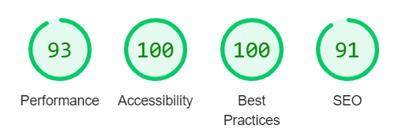

# Portfolio Website

Welcome to my portfolio website! This site showcases my projects and skills.

## Technologies Used

- **React.js + Vite Framework**: For building a fast and efficient user interface.
- **Three.js**: For creating 3D graphics and interactive elements.
- **Email.js**: For handling email functionality.

## Optimization

The website has been optimized for performance and scored well in Lighthouse audits (for Desktop).



## Installation and Setup

To run this project locally, follow these steps:

1. **Clone the repository:**
    ```bash
    git clone https://github.com/yourusername/your-repository.git
    ```

2. **Navigate to the project directory:**
    ```bash
    cd your-repository
    ```

3. **Install dependencies:**
    ```bash
    npm install
    ```

4. **Start the development server:**
    ```bash
    npm run dev
    ```

5. **Open your browser and go to:**
    ```
    http://localhost:3000
    ```

## Deployment

The website is deployed and can be accessed at [vercel](https://vedantghumade-portofolio.vercel.app/).

## License

This project is licensed under the MIT License. See the [LICENSE](LICENSE) file for more details.
